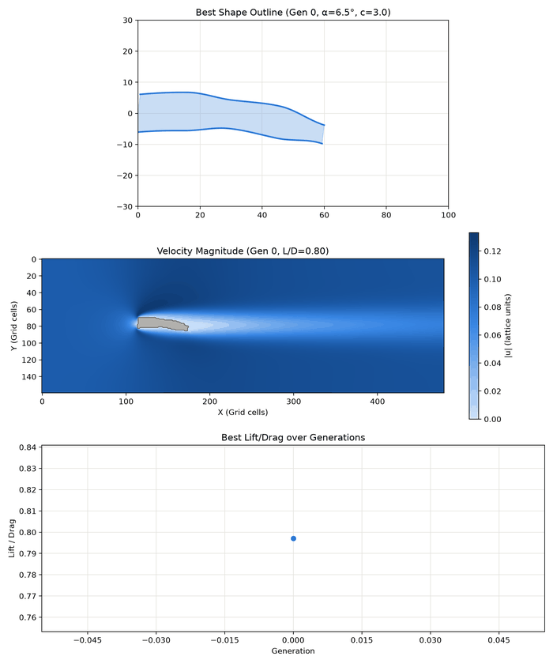

# DeCFD: decentralized evolutionary aerodynamics

A genetic algorithm designs airfoil shapes. A network of miners runs the wind-tunnel
simulations. Miners who fake results get caught and slashed.



Design optimization by simulation needs thousands of independent CFD runs, which makes it
a natural workload for a DePIN / ComputeFi network. The hard part is trusting results that
come from strangers. DeCFD combines a deterministic solver, hash commitments, optimistic
audits and staking with slashing, so a faked result costs the miner more than it earns.

## Status (hackathon MVP)

| Layer | State |
|---|---|
| Physics worker: C++ lattice Boltzmann, D2Q9 | ✅ deterministic, ≈ 3 s per evaluation |
| Optimizer: genetic algorithm with adaptive mutation | ✅ |
| Network: tasks, miners, audits, slashing, payouts | ✅ local mock; the ledger mirrors a Solana Anchor program |
| Live dashboard | planned |
| Solana devnet program | planned |

## Quick start (Windows)

Requirements: Python 3.9+ and Visual Studio 2019+ (or Build Tools) with the
*Desktop development with C++* workload.

```powershell
pip install -r orchestrator_py/requirements.txt
powershell -ExecutionPolicy Bypass -File build.ps1          # -> worker_cpp\worker.exe
python orchestrator_py/app.py --pop 12 --gen 20 --quiet-net # ≈ 11 min on a 12-thread laptop
python orchestrator_py/make_gif.py                          # GIF of the latest run
```

`python orchestrator_py/app.py` with no flags is a smoke test: 4 shapes × 3 generations,
about a minute.

**CMake** (any platform; used by the VS Code CMake Tools extension):

```bash
cmake -S worker_cpp -B worker_cpp/build/cmake -DCMAKE_BUILD_TYPE=Release
cmake --build worker_cpp/build/cmake --config Release      # -> worker_cpp/worker[.exe]
```

The CMake build is tested with MSVC. GCC/Clang with OpenMP should work but has not been
tested yet.

## Options

| Flag | Default | Meaning |
|---|---|---|
| `--pop` | 4 | shapes per generation |
| `--gen` | 3 | generations (= network epochs) |
| `--miners` | 4 | mock miner nodes |
| `--cheaters` | 1 | how many of them are lazy |
| `--cheat-prob` | 0.5 | chance a lazy miner fakes a task |
| `--verify-rate` | 0.2 | fraction of tasks audited at random |
| `--parent-audit` | off | also audit every unverified tournament winner before it reproduces |
| `--seed` | 42 | GA seed; runs are reproducible |
| `--quiet-net` | off | hide per-task log lines (fraud events are still shown) |

## What a run does

Each generation is one network epoch:

1. Every new shape becomes a task. The client locks the reward in escrow, and the task pins the hash of the parameters and of `worker.exe`.
2. Miners compute in parallel and submit a hash of their result.
3. The verifier re-computes a random 20% of tasks, plus the generation leader before it becomes the elite. With `--parent-audit`, every selected parent is audited as well.
4. A mismatch slashes 50% of the miner's stake, refunds the client and triggers a re-audit of the miner's other work in this epoch. A miner whose stake drops below the minimum is banned.
5. The epoch closes and every surviving task is paid.

Typical console output:

```
  [FRAUD] g1-t0007 by miner-4: claimed L/D=4.141, real L/D=0.567. Slashed -> stake 25  >>> BANNED  [leader check]
Best: L/D=0.567 (Drag=0.67876, Lift=0.38481) | ... | by verifier (fraud by miner-4 corrected) | epoch paid 40
```

The run ends with a network report (earnings, stakes, fraud caught) and a 30 000-step
re-run of the best shape.

## Outputs

Each run gets its own folder, `orchestrator_py/runs/<date-time>_seed<N>/`:

| | |
|---|---|
| `history.json` | config, best shape of every generation, final check (rewritten after each generation) |
| `frames/` | one image per generation: shape, velocity field, L/D curve |
| `network/ledger_tx.jsonl` | every ledger instruction, block-explorer style |
| `network/ledger_state.json` | final balances, stakes, task statuses |
| `evolution.gif` | written by `make_gif.py` |

## Demo run

`python orchestrator_py/app.py --pop 12 --gen 20 --quiet-net`: seed 42, 4 miners, one of
them lazy, on a 12-thread laptop.

| | |
|---|---|
| Best L/D | 0.80 in generation 0 → 2.27 in generation 19 |
| Same shape re-run with 30 000 steps | 2.28 (+0.6%) |
| Best genotype | t = 1.07 / 4.53 / 6.00 / 5.00 / 6.00 cells, α = 13.1°, camber 1.7 |
| Fraud | 2 faked results, both caught in epoch 0, lazy miner banned |
| Earnings | honest miners 720–730 each; the lazy miner kept 10 for its single honest task and lost 75 of its 100 stake |

Cost of auditing parents:

| | default | `--parent-audit` |
|---|---|---|
| Audits / tasks | 59 / 221 (27%) | 161 / 221 (73%) |
| Run time | 11.1 min | 15.6 min |
| Fraud caught | 2 of 2 | 2 of 2 |

Both runs follow the same trajectory. Here the lazy miner is banned in the first epoch, so
later parent audits only re-check honest work. They pay off when a cheater survives longer.

## Honest caveats

- **Physics.** 2D, laminar, Reynolds number ≈ 180: the regime of insects and micro-drones, not of aircraft. The model converges: a 30k-step run and a 2× finer grid each change L/D by about 0.5% for GA-type shapes. It has not been validated against a wind tunnel. Shapes are "optimal for this model", not real wings.
- **Objective.** Maximizing Cl/Cd in 2D ignores induced drag. The network layer does not care what the fitness function is, so a client could ask for minimum drag at a fixed lift instead.
- **Network.** There is a single trusted verifier, and the ledger is a local mock. Bit-exact verification assumes every miner runs the same binary.

Details, validation numbers and the on-chain program spec are in
[architecture.md](architecture.md).

## Repository layout

```
build.ps1                    Windows build script (MSVC)
worker_cpp/main.cpp          LBM solver: shape parameters in, drag/lift JSON out
worker_cpp/CMakeLists.txt
orchestrator_py/app.py       genetic algorithm (the network's client)
orchestrator_py/network/     ComputeNetwork, mock Solana program, miners
orchestrator_py/worker_runner.py, runs.py, visualizer.py, make_gif.py
architecture.md              design, protocol, validation, limitations
```
