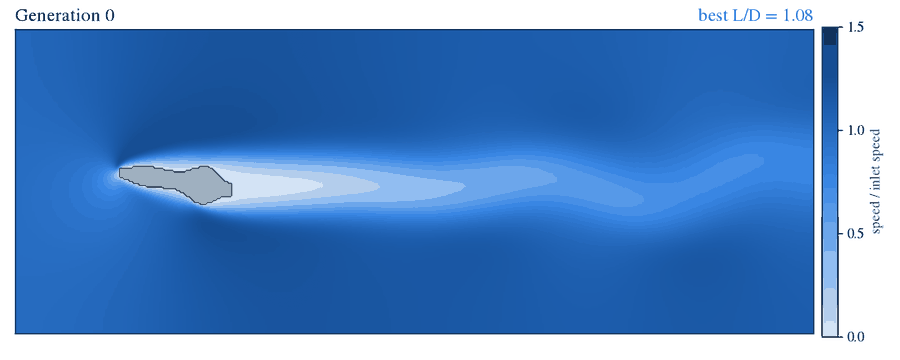
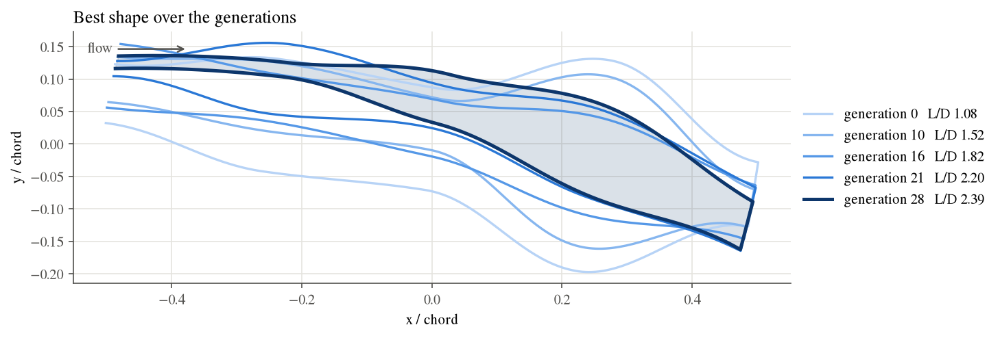
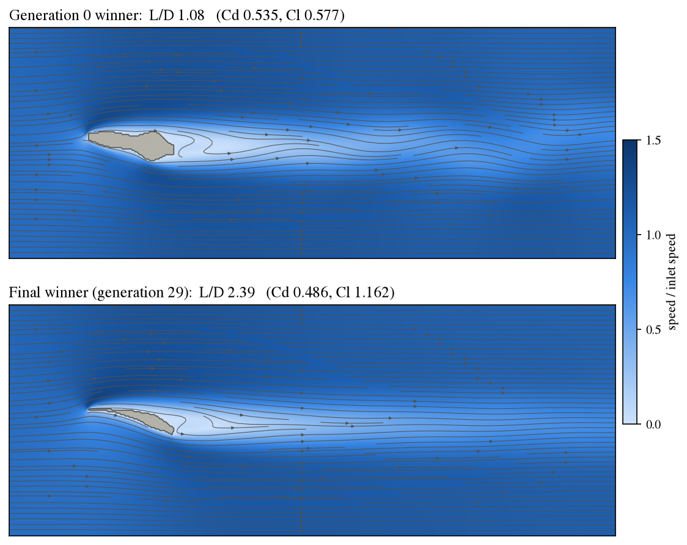
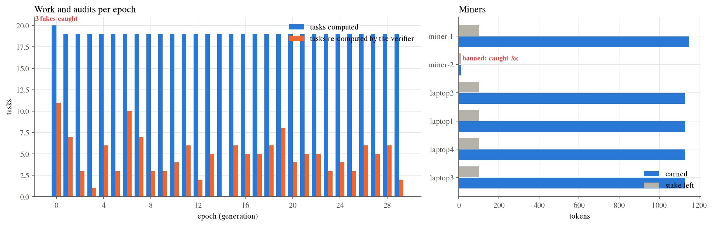
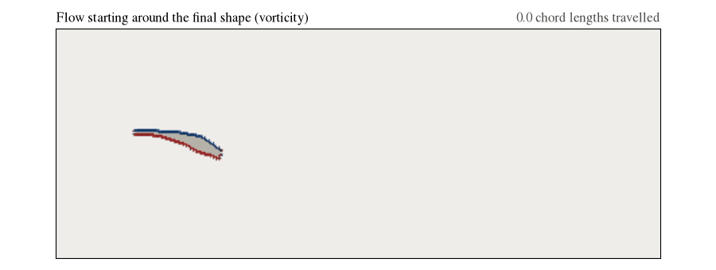
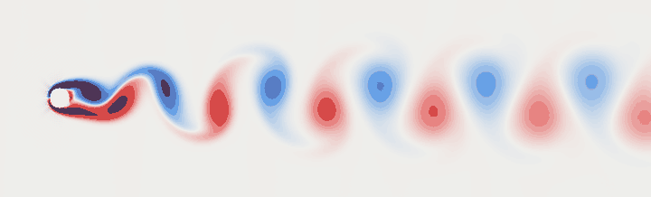

# DeCFD: decentralized evolutionary aerodynamics

A genetic algorithm designs wing profiles. A network of miners runs the wind-tunnel
simulations. A Solana program holds the money: miners who fake results get caught and lose
their stake.



**[Open the demo dashboard](https://chuikomykhail-droid.github.io/DeCFD/demo/)**: a real run on
Solana devnet with four laptops as remote miners, replayed. Evolution, miners, stakes, a
timeline of every task, and every one of its 1,863 transactions linked to the Solana explorer.

## Why

Design optimization by simulation needs thousands of independent CFD runs: a natural
workload for a DePIN / ComputeFi network. The hard part is trusting results computed by
strangers. DeCFD makes a fake result cost more than it earns:

- **Deterministic solver.** The same binary and inputs give bit-identical output, so any
  result can be re-checked exactly.
- **Commit, then audit.** Miners submit a hash of each result; a verifier re-computes a
  random 20% plus every result the optimizer is about to build on.
- **Stake and slashing.** A mismatch costs the miner half its stake (half of that goes to
  the verifier); a second catch bans it. The client's budget sits in escrow and pays only
  for tasks that survive.

## Status

| Layer | State |
|---|---|
| Physics worker: C++ lattice Boltzmann (D2Q9), validated on the cylinder benchmark | ✅ |
| Optimizer: genetic algorithm with adaptive mutation | ✅ |
| Solana program (Anchor): escrow, tasks, stakes, commitments, audits, slashing, payouts | ✅ deployed on devnet: [`5ChZDUU3…7cTXwrLrQPC`](https://explorer.solana.com/address/5ChZDUU3RrNuUBHUBfNgFhj44bNoq5VRQ7cTXwrLrQPC?cluster=devnet) |
| Remote miner node: finds its tasks on chain, signs its own results | ✅ packaged for Windows machines without Python |
| In-memory mock of the program, behind the same `Ledger` interface | ✅ for tests and offline runs |
| Dashboard (live and replay), run report, tests | ✅ |

## Demo run: Solana devnet, four laptops

```
python orchestrator_py/app.py --ledger devnet --remote 4 --miners 2 --cheaters 1 --pop 20 --gen 30 --quiet-net
```

Four 2019 office laptops (Dell Latitude 5400, Core i5-8365U) ran the packaged miner node, each
with its own devnet wallet. They never talked to the coordinator: they read their tasks from
the program and submitted signed results to it. The coordinator added one honest miner and
one lazy one that fakes results. Seed 42, 47 minutes.

| | |
|---|---|
| Best lift / drag | 1.08 in generation 0 → **2.39** in generation 29 (+122%) |
| Same shape re-run with 30 000 steps | 2.40 (+0.5%) |
| Tasks / audits | 571 / 144 (25% re-computed) |
| Laptops | 452 tasks (113 each), every result signed by the laptop's own wallet |
| Fraud | 3 fakes, all caught; the cheater was banned in generation 0 |
| Job budget 6000 | 5680 paid for honest work, 320 refunded to the client |
| Slashed stake 87.5 | 43.75 to the verifier, 43.75 to the treasury |
| On chain | 1,863 transactions; their base fees came to 0.0093 SOL |







The final shape is a cambered profile at 14.6°; the random shapes of generation 0 reach at
most 1.08. The animation below shows the flow starting from rest around the final shape, with
the starting vortex leaving the trailing edge.




## Is the solver right?

Before trusting the optimizer, the solver is checked on the textbook benchmark: flow past a
circular cylinder, compared with published values ([full report](docs/validation/cylinder.md)).

| Benchmark | DeCFD | Published range |
|---|---|---|
| Re = 20: drag coefficient Cd | 2.15 | 2.00–2.22 |
| Re = 20: wake length Lr/D | 0.95 | 0.91–0.94 |
| Re = 40: drag coefficient Cd | 1.60 | 1.48–1.62 |
| Re = 40: wake length Lr/D | 2.33 | 2.13–2.35 |
| Re = 100: shedding frequency (Strouhal) | 0.165 | 0.160–0.175 |
| Re = 100: mean drag Cd | 1.37 | 1.33–1.38 |
| Re = 100: lift amplitude | 0.34 | 0.25–0.34 |

Values are at 40 cells per diameter. Everything falls inside the published range except
the Re = 20 wake length, 1.4% above it; halving the cell size moves every value towards
the references.



## Quick start (Windows)

Requirements: Python 3.9+ and Visual Studio 2019+ (or Build Tools) with the
*Desktop development with C++* workload.

```powershell
pip install -r orchestrator_py/requirements.txt
powershell -ExecutionPolicy Bypass -File build.ps1          # -> worker_cpp\worker.exe
python orchestrator_py/serve.py                             # dashboard at http://localhost:8000
python orchestrator_py/app.py --pop 12 --gen 20 --quiet-net # ≈ 12 min on a 12-thread laptop
```

Open the dashboard while the run is going: it updates every two seconds, and the
*Network activity* timeline shows which miner is computing which task right now. The
report (`report/` in the run folder) is built automatically at the end.

### On Solana devnet, with remote miners

The program is already deployed; [solana/README.md](solana/README.md) shows how to deploy your
own copy with Solana Playground. With a funded client wallet in `.keys/client.json`:

```powershell
python orchestrator_py/devnet.py status                    # program, wallets, balances
python orchestrator_py/package_miner.py --machines 4       # zip with miner.exe + funded node wallets
# copy decfd-miner.zip to each machine, run start.bat there (it waits for a run), then:
python orchestrator_py/app.py --ledger devnet --remote 4 --pop 12 --gen 10 --quiet-net
```

Each node first re-computes reference cases and refuses to join if its CPU does not
reproduce them bit for bit. It then registers with a stake, finds the tasks assigned to it
on chain, and signs its own results. Without remote nodes, `--ledger devnet` runs the
local miners against the devnet program.

| Command | What it does |
|---|---|
| `python orchestrator_py/app.py` | Smoke test: 4 shapes × 3 generations, about a minute |
| `python orchestrator_py/report.py [run]` | Rebuild a run's report |
| `python orchestrator_py/export_demo.py [run]` | Export the dashboard + a run to `docs/demo/` (GitHub Pages) |
| `python -m unittest discover -s tests` | Ledger rules, worker determinism, fraud detection (≈ 15 s) |
| `python validation/cylinder.py` | Cylinder benchmark (≈ 1.5 h; needs the bigger-grid builds, see the script) |

**CMake** (any platform; also used by the VS Code CMake Tools extension):

```bash
cmake -S worker_cpp -B worker_cpp/build/cmake -DCMAKE_BUILD_TYPE=Release
cmake --build worker_cpp/build/cmake --config Release      # -> worker_cpp/worker[.exe]
```

The CMake build is tested with MSVC. GCC/Clang with OpenMP should work but has not been
tested yet.

## Options

| Flag | Default | Meaning |
|---|---|---|
| `--pop` | 4 | shapes per generation |
| `--gen` | 3 | generations (= network epochs) |
| `--miners` | 4 | local miners (threads of the coordinator) |
| `--cheaters` | 1 | how many of them are lazy |
| `--cheat-prob` | 0.5 | chance a lazy miner fakes a task |
| `--verify-rate` | 0.2 | fraction of tasks audited at random |
| `--parent-audit` | off | also audit every unverified tournament winner before it reproduces |
| `--steps`, `--avg` | 6000, 2000 | solver steps per evaluation and steps averaged (job-wide) |
| `--ledger` | mock | `mock` (in memory) or `devnet` (the deployed Solana program) |
| `--remote` | 0 | devnet: wait for N miner nodes to join on their own |
| `--remote-timeout` | 600 | devnet: seconds to wait for nodes to join, and for a node's result |
| `--challenge-window` | 10 | devnet: seconds before an unaudited task can be settled |
| `--seed` | 42 | GA seed; runs are reproducible |
| `--quiet-net` | off | hide per-task log lines (fraud events are still shown) |

## How it works

Each generation of the GA is one network epoch:

1. The client opens a **job** once per run and escrows its budget. The job pins the hash of `worker.exe`.
2. Every new shape becomes a **task** that reserves one reward and pins the hash of its parameters.
3. Miners compute in parallel and **submit a hash** of their result.
4. The verifier re-computes a random 20% of tasks plus the generation leader before it becomes the elite.
5. A mismatch **slashes** the miner and triggers a re-audit of its other work in this epoch.
6. Every surviving task is **settled** (paid). At the end the unspent budget returns to the client.

All chain access goes through one interface, [`network/ledger.py`](orchestrator_py/network/ledger.py),
with two implementations: the Anchor program in [`solana/programs/decfd`](solana/programs/decfd/src/lib.rs),
deployed on devnet, and an in-memory mock of it for tests. Details, economics and the
event-log format are in [architecture.md](architecture.md).

## Honest caveats

- **Physics.** 2D, laminar, Reynolds number ≈ 180: the regime of insects and micro-drones, not of aircraft. Shapes are "optimal for this model", not real wings.
- **Objective.** Maximizing lift/drag in 2D ignores induced drag. The network does not care what the fitness function is, so a client could ask for minimum drag at a fixed lift instead.
- **Network.** The program runs on devnet only, and there is a single trusted verifier. Bit-exact verification needs every miner to run the same binary; the job pins its hash, and nodes check their CPU with a self-test. Task accounts are not closed after payment, so their rent is not reclaimed yet.

## Repository layout

```
build.ps1                    Windows build script (MSVC)
worker_cpp/main.cpp          LBM solver: shape parameters in, drag/lift JSON out
orchestrator_py/app.py       genetic algorithm (the network's client)
orchestrator_py/network/     Ledger interface, devnet client, mock program, wallets, miners, ComputeNetwork
orchestrator_py/miner_node.py      remote miner node; package_miner.py builds it for Windows
orchestrator_py/devnet.py    devnet setup, status and funding
orchestrator_py/report.py    run report; serve.py / export_demo.py for the dashboard
solana/                      Anchor program (programs/decfd), deployment notes
dashboard/                   web dashboard (HTML/JS, no build step)
validation/cylinder.py       solver validation
tests/                       unit and end-to-end tests
docs/                        validation report, exported demo
architecture.md              design, protocol, economics, validation, limitations
```

## License

[MIT](LICENSE)
