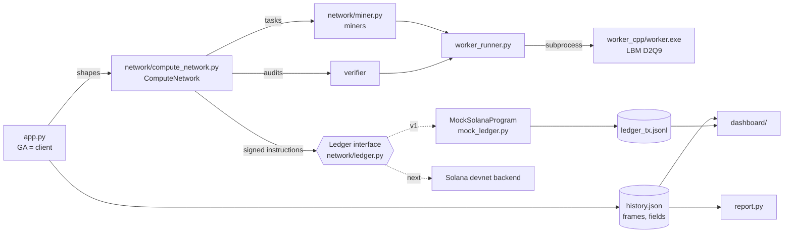

# DeCFD Architecture

DeCFD is a decentralized evolutionary design optimizer. A client posts a design job with a
budget, a genetic algorithm (GA) proposes shapes, and every shape evaluation becomes a
compute task. Miners run a deterministic CFD solver, commit to their results by hash, and
get paid per task. A verifier re-computes a sample of the results; a miner caught faking
a result loses stake, part of which rewards the verifier.

In v1 everything runs on one machine and the blockchain is an in-memory mock. The mock is
written as the specification of the Solana program and sits behind a `Ledger` interface,
so a devnet backend replaces it without touching the GA, the network logic or the dashboard.

> This file describes the system as built. The original one-page spec that started the
> project is in git history: `git show 1a38afa:architecture.md`.

## 1. Components



| Path | Role |
|---|---|
| `worker_cpp/main.cpp` | Physics engine: 2D lattice Boltzmann wind tunnel, returns drag and lift as JSON |
| `orchestrator_py/app.py` | GA. Acts as the network's client: opens the job, accepts only trusted results |
| `orchestrator_py/network/compute_network.py` | Dispatch, audits, slashing flow, settlement; the GA's only entry point to the network |
| `orchestrator_py/network/ledger.py` | `Ledger` interface: accounts, instructions, event log. The spec of the Solana program |
| `orchestrator_py/network/mock_ledger.py` | In-memory implementation of `Ledger` |
| `orchestrator_py/network/wallet.py` | Signing identities (mock: HMAC; devnet: ed25519 keypairs) |
| `orchestrator_py/network/miner.py` | Mock miners. A "lazy" miner sometimes returns made-up numbers |
| `orchestrator_py/worker_runner.py` | Runs the binary, parses its output, computes result hashes |
| `orchestrator_py/visualizer.py`, `geometry.py` | Flow-field storage and per-generation frames; shape outlines |
| `orchestrator_py/report.py` | Static report of a run (figures, animations, summary.json) |
| `dashboard/`, `orchestrator_py/serve.py`, `export_demo.py` | Web dashboard: live for local runs, static export for GitHub Pages |
| `validation/cylinder.py` | Solver validation against the cylinder benchmark |
| `tests/` | Ledger rules, worker determinism, end-to-end fraud detection (`python -m unittest discover -s tests`) |

## 2. Physics worker (C++)

**Method.** D2Q9 lattice Boltzmann with the BGK collision operator, single precision
(`float`, switchable via the `REAL` macro), OpenMP over rows.

**Domain.** 480 × 160 cells (compile-time `NX`, `NY`; `build.ps1 -NX -NY` builds other
sizes). The inlet on the left is held at equilibrium with `u_in = 0.1`. The outlet on the
right is zero-gradient. Top and bottom walls are free-slip (specular reflection); define
`PERIODIC_Y` to make them periodic.

**Geometry (the genotype).**
- chord `L` (fixed at 60 cells by the GA);
- five full-thickness points `t0..t4` at 0, ¼, ½, ¾ and 1 of the chord, joined by cosine interpolation;
- `camber`: parabolic mean line whose peak height at mid-chord is `camber` cells;
- `alpha`: angle of attack in degrees, positive = nose up, rotation about the chord midpoint at `x = 0.3·NX`.

`--cylinder D` replaces the airfoil with a circle (used by the validation). The shape is
rasterized into solid cells with halfway bounce-back on the surface.

**Forces.** Momentum exchange over all fluid→solid links (`F = Σ 2·f_j·c_j`), averaged over
the last `avg` steps. `cd = Fx / (½·u_in²·L)`, `cl = Fy / (½·u_in²·L)`. `*_spread` is the
max − min of four block means over the averaging window, an indicator of unsteadiness.

**Interface.**

```
worker L t0 t1 t2 t3 t4 [alpha] [camber] [options]
worker --cylinder D [options]
options: --steps 6000 --avg 2000 --tau 0.6 --uin 0.1 --yshift 0
         --csv |u|.csv --vort w.csv --ux ux.csv --uy uy.csv
         --history forces.csv            Fx, Fy for every averaged step
         --snap-every N --snap-prefix P  float32 vorticity snapshots during averaging
```

stdout is one JSON line: `{"fx","fy","cd","cl","fx_spread","fy_spread","steps","avg","nx","ny"}`.
Exit codes: 2 = bad arguments, 3 = empty body or body touching the domain edge, 4 = diverged.

**Flow regime.** `ν = (τ − 0.5)/3 = 1/30`, so `Re = u_in·L/ν = 180`; Mach ≈ 0.17. This is
the viscous, laminar regime of insects and micro-drones, not of aircraft (see §7).

**Determinism (the basis of verification).** The same binary with the same arguments
produces bit-identical output, independent of the OpenMP thread count: rows are updated
independently and the force sum is serial. Tests check this. The binary links the C runtime
statically, so the math library used by the rasterizer is part of the binary whose hash
each job pins.

**Speed** (dev laptop, 12 logical cores, MSVC build): about 31 MLUPS on one thread,
saturating at about 150 MLUPS from 6 threads up. One 6000-step evaluation takes ≈ 3 s
using all cores, or ≈ 15 s on one.

## 3. Optimizer (GA)

| | |
|---|---|
| Genes | `t0..t4` ∈ [0, 30] cells (`t4` ≤ 0.1·L), `alpha` ∈ [−5°, 20°], `camber` ∈ [0, 10] cells |
| Fixed | `L = 60`. A free chord would "win" by raising the Reynolds number, not by better shape |
| Fitness (minimized) | `−Cl/Cd + 5·max(0, 1 − area/250)`, a soft minimum-area penalty. Diverged → ∞ |
| Selection | elitism (1), tournament of 2 |
| Crossover | blend: random weight per gene |
| Mutation | Gaussian, probability 0.3 per gene; step size adapted by Rechenberg's 1/5 rule over 4-generation windows (×1.15 / ×0.87, clamped to [0.18, 2]) |
| Stagnation | 8 generations without improvement → step 1.5 and 15% random immigrants |
| Final check | best shape re-run with 30 000 steps (averaging 20 000) |

**Trust rules.** The GA never builds on an unverified leader:
1. The generation leader is always verified before it becomes the elite.
2. Parent audit (off by default, `--parent-audit` turns it on): every unverified
   tournament winner is verified before it may reproduce. If an audit catches fraud,
   selection is redone with corrected values. In the demo scenario it caught nothing and
   raised the audit share from 27% to 73% of tasks, hence opt-in.

Both checks run before the epoch is settled, so a miner caught by them is never paid
for that task.

## 4. Network and ledger

### The `Ledger` interface

`network/ledger.py` defines every account and instruction; `ComputeNetwork` talks to the
chain only through it, and every instruction is signed by a wallet (`pubkey` + `sign`).

| Accounts | Fields |
|---|---|
| Config | verifier, min_stake, slash_bps, verifier_share_bps (set once by `initialize`) |
| Job | client, budget, escrow, reserved, reward, binary_hash, tasks, status |
| MinerAccount | stake, earned, slashed, tasks, caught, status (`active` / `banned`) |
| TaskAccount | job, epoch, params_hash, reward, miner, result_hash, status: `open` → `submitted` → (`verified`) → `finalized`, or `rejected` |
| Treasury | the part of slashed stake that does not go to the verifier |

| Instruction | Signer | Effect |
|---|---|---|
| `initialize` | admin | set Config |
| `register_miner(stake)` | miner | stake moves from the miner's wallet |
| `create_job(budget, reward, binary_hash)` | client | budget moves into the job's escrow |
| `create_task(params_hash, epoch)` | client | reserves one reward from the job |
| `submit_result(result_hash)` | miner | commitment to the result; only an active miner, only an open task |
| `resolve_challenge(verifier_hash)` | verifier | match → `verified`; mismatch → slash, release the reward back to the job, ban below `min_stake` |
| `settle_task` | anyone (crank) | pay a submitted/verified task from escrow |
| `close_job` | client | refund the unreserved escrow |

Each instruction touches a bounded set of accounts, so each maps onto one Solana
instruction. (The first mock paid a whole epoch in one loop, which a Solana transaction
cannot do; v1 settles task by task.) The mock conserves the token supply: wallets +
treasury + stakes + escrows always equal the total airdropped, and the tests check it.

### Epoch flow (one generation = one epoch)

```mermaid
sequenceDiagram
    participant C as Client (GA)
    participant P as Program (ledger)
    participant M as Miner
    participant V as Verifier
    C->>P: create_job(budget) once per run
    C->>P: create_task(params_hash), reserves a reward
    P->>M: task (round-robin over active miners)
    M->>M: run worker
    M->>P: submit_result(result_hash)
    Note over V: random audit (verify_rate) + leader check (+ parent check)
    V->>V: re-run worker
    V->>P: resolve_challenge(verifier_hash)
    alt hashes match
        P->>P: task = verified
    else mismatch
        P->>P: slash 50% of stake: half to the verifier, half to the treasury; ban if stake < min
        V->>P: re-audit the caught miner's other tasks in this epoch
    end
    C->>P: settle_task for every task of the epoch
    C->>P: close_job at the end: unspent budget returns
```

### Commitments

| Hash | Definition |
|---|---|
| `params_hash` | `sha256(" ".join(args))`: the exact worker command line (shape + job-wide solver settings) is the task definition |
| `binary_hash` | `sha256(worker.exe)`, pinned by the job: bit-exact verification only holds for identical builds |
| `result_hash` | `sha256(json({task, result: {fx, fy, cd, cl}}))`, or `{error: code}` for a failed run. Diagnostic fields are excluded |

### Economics

Defaults: reward 10 per task, stake 100, minimum stake 50, slash 50% of the stake, verifier
share 50% of the slash, random audit rate 20%.

A fake is caught with probability at least `verify_rate` (more if it becomes the leader,
or if the miner was already caught this epoch). Faking is unprofitable when
`P(caught) × slash > reward`. With the defaults the first fake is break-even in expectation
(0.2 × 50 = 10); the second catch bans the miner, which also forfeits all future income
and the remaining stake, so repeated cheating loses. A stricter margin needs a higher
audit rate or slash; both are one parameter each.

### Event log (the contract with the dashboard)

Every instruction appends one JSON line to `network/ledger_tx.jsonl`:
`{"sig", "slot", "ix", "signer", ...}` with these fields per `ix`:

| ix | Fields |
|---|---|
| `initialize` | verifier, min_stake, slash_bps, verifier_share_bps |
| `register_miner` | name, stake |
| `create_job` | job, budget, reward, binary_hash |
| `create_task` | job, task, epoch, params_hash, reward |
| `submit_result` | task, result_hash |
| `verify_ok` | task |
| `slash` | task, miner, penalty, to_verifier, expected, got, banned |
| `settle_task` | task, miner, paid |
| `close_job` | job, refund |

`network/participants.json` maps public keys to roles and names. A devnet backend writes
the same records with real transaction signatures, so the dashboard keeps working and can
link each event to the Solana explorer.

### Concurrency

Tasks of one batch run in parallel threads, and each worker process gets
`cpu_count // batch_size` OpenMP threads. Results do not depend on the thread count, so
this changes speed only: a lone audit uses the whole machine instead of one core.

## 5. Run artifacts, report and dashboard

Each run writes to `orchestrator_py/runs/<YYYYmmdd-HHMMSS>_seed<N>/`:

```
history.json               config, per-generation best shape + population L/D, timing, final check
fields/best_g000.npz ...   u_x, u_y of each generation's best shape (compressed)
frames/field_000.png ...   one frame per generation: the best shape's flow field
network/ledger_tx.jsonl    event log (§4)
network/participants.json  public key -> role / name
network/ledger_state.json  final snapshot of all accounts
report/                    written by report.py at the end of the run
```

`history.json` is rewritten atomically after every generation; non-finite numbers are
stored as `null`.

**Report** (`report.py`): `convergence.png` (best L/D over the whole population),
`shapes.png` (best shape at several generations, overlaid), `before_after.png` (flow with
streamlines around the generation-0 and final winners), `genes.png` (each design
parameter over time), `network.png` (tasks, audits and fraud per epoch; earnings and stakes
per miner), `evolution.gif` (the flow-field frames), `startup.gif` (vorticity as the flow
starts around the final shape, from a dedicated run with snapshots) and `summary.json`.

**Dashboard** (`dashboard/`, no build step): KPIs, the flow field of any generation with a
player, the convergence chart, miners and their stakes, the job's economics, the event
feed and the report. `serve.py` serves local runs and the page polls them every 2 s while
a run is in progress; `export_demo.py` copies the dashboard and one finished run into
`docs/demo/` for GitHub Pages.

## 6. Validation

**Cylinder benchmark** (`validation/cylinder.py`, full report in
[docs/validation/cylinder.md](docs/validation/cylinder.md)): flow past a circular cylinder
at Re = 20 and 40 (steady wake) and Re = 100 (vortex street), at two resolutions, compared
with published values for an unbounded cylinder.

| Benchmark | DeCFD | Published range |
|---|---|---|
| Re = 20: drag coefficient Cd | 2.15 | 2.00–2.22 |
| Re = 20: wake length Lr/D | 0.95 | 0.91–0.94 |
| Re = 40: drag coefficient Cd | 1.60 | 1.48–1.62 |
| Re = 40: wake length Lr/D | 2.33 | 2.13–2.35 |
| Re = 100: shedding frequency (Strouhal) | 0.164 | 0.160–0.175 |
| Re = 100: mean drag Cd | 1.42 | 1.33–1.38 |
| Re = 100: lift amplitude | 0.38 | 0.25–0.34 |

Values are from the finest grid run for each case (D = 40 cells for Re = 20 and 40, D = 20 for
Re = 100). Doubling the resolution moves the steady-wake values towards the references; the
excess at Re = 100 matches the 5% blockage of the channel.

Running Re = 100 at Mach 0.17 first produced a lift amplitude above 3: the shedding frequency
sat at 1.14× the channel's first transverse acoustic mode (c_s / 2H, free-slip walls reflect
sound perfectly), and the two locked together. At Mach 0.087 the shedding sits at 0.57× the
mode and the street is clean.

The GA's own domain (480 × 160, Mach 0.17) has the same kind of mode, and the impulsive start
excites it: behind the demo's final shape the lift oscillates with a period of ≈ 600 steps
(0.93× the mode's frequency). Here it decays, and the wake of this shape is steady: the lift
amplitude falls from 0.12 around 6k steps to 0.003 around 14k and 0.0002 at 30–40k, and the
averaged forces agree with a 30k-step run to 0.6%. A shape with a shedding wake near that frequency would lock in, so
designs with unsteady wakes need a lower Mach number or absorbing boundaries.

**Airfoil convergence.** All numbers are L/D from this worker.

| Shape | 6k steps | 30k steps | 2× finer grid, same Re |
|---|---|---|---|
| A: thin, `t = 2/8/6/3/0.5`, α = 12°, camber 3 | 1.848 | 1.858 (+0.5%) | 1.940 (+4.4%) |
| B: GA-type, `t = 2/2.5/4/6/6`, α = 15.5°, camber 5.6 | 2.511 | 2.520 (+0.4%) | 2.534 (+0.5%) |

6000 steps (≈ 1.25 flow-through times) is within 0.5% of a 30k-step run. The finer grid is
960 × 320 with everything scaled ×2 and τ = 0.7, which keeps Re = 180 and Mach the same.
Shape A has a 0.5-cell trailing edge, thinner than one cell, so it moves by 4%. A symmetric
profile at α = 0 gives Cl ≈ 10⁻⁷; α = ±8° gives Cl = ±0.4511, antisymmetric to 7 digits.

## 7. Limitations

**Physics.** 2D, laminar, Re ≈ 180. The channel is about 2.7 chords high with free-slip
walls, and the geometry is staircase. At this Reynolds number thin cambered plates at high
angle of attack win, and a blunt trailing edge adds lift (a Gurney-flap-like effect, our
interpretation). That is why `t4` is capped at 0.1·L. Results are "optimal for this model",
not a real wing.

**Objective.** Maximizing Cl/Cd in 2D ignores induced drag. Real wing design minimizes Cd
at a fixed Cl over several operating points. Only the fitness function would change; the
network layer is independent of the objective.

**Network.**
- Miners are threads of one process, and the ledger is an in-memory mock.
- There is a single trusted verifier. It earns a share of slashed stake but no fee per audit.
- Bit-exact comparison assumes an identical binary. Even then, CRT `sin`/`cos` can pick
  different code paths on different CPUs, and in rare cases a boundary cell could flip,
  failing an honest miner. A real deployment needs integer or fixed-point rasterization or a
  tolerance-based comparison, plus reproducible builds.
- A miner-side failure such as a timeout hashes as an error and would be slashed. The worker timeout is therefore generous (300 s).
- A faked result that is never sampled and never the leader (nor a parent, with `--parent-audit`) goes undetected. It can still win tournaments and pass its genes on; the children are evaluated honestly. The end-of-run report counts these cases.

## 8. Roadmap

1. **Solana devnet backend.** An Anchor program implementing §4 one instruction per
   method, and a `SolanaLedger(Ledger)` client (wallets become ed25519 keypairs, `airdrop`
   maps to `requestAirdrop`, events carry real signatures). Then `app.py --ledger devnet`.
2. Miners as separate processes or hosts that pull tasks from a queue and sign their own submissions.
3. Client-defined objectives: minimum Cd at fixed Cl, several angles of attack, geometry constraints.
4. A verifier fee per audit and a decentralized verifier set.
