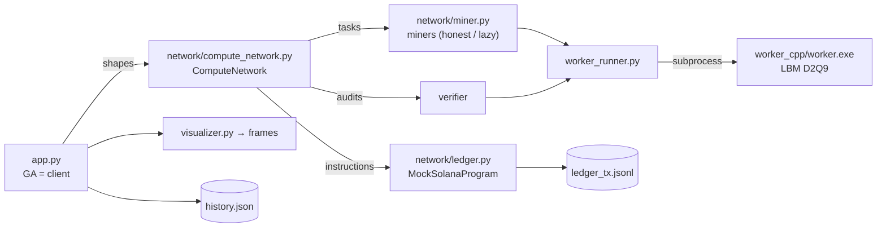
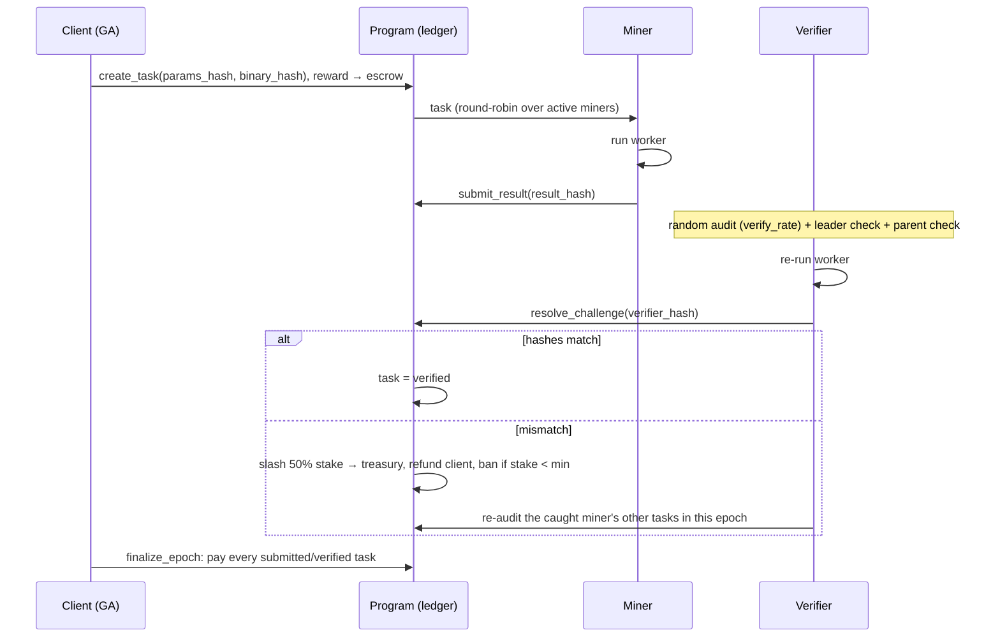

# DeCFD Architecture

DeCFD is a decentralized evolutionary design optimizer. A client posts a design job, a
genetic algorithm (GA) proposes shapes, and every shape evaluation becomes a compute task.
Miners run a deterministic CFD solver to execute the tasks, commit to their results by
hash, and get paid per epoch. A verifier re-computes a sample of the results, and a miner
caught faking a result loses half its stake.

For the hackathon MVP the network runs locally on one machine. The ledger is a Python mock
whose accounts and instructions mirror the Anchor program we plan to deploy on Solana.

> This file describes the system as built. The original one-page spec that started the
> project is in git history: `git show 1a38afa:architecture.md`.

## 1. Components



| Path | Role |
|---|---|
| `worker_cpp/main.cpp` | Physics engine: 2D lattice Boltzmann wind tunnel, returns drag and lift as JSON |
| `orchestrator_py/app.py` | GA. Acts as the network's client: posts tasks, accepts only trusted results |
| `orchestrator_py/network/compute_network.py` | The GA's only entry point to the network. Dispatch, audits, slashing flow |
| `orchestrator_py/network/ledger.py` | Mock on-chain program. The spec for the Solana smart contract |
| `orchestrator_py/network/miner.py` | Mock miners. A "lazy" miner sometimes returns made-up numbers |
| `orchestrator_py/worker_runner.py` | Runs the binary, parses its output, computes result hashes |
| `orchestrator_py/visualizer.py`, `make_gif.py` | One frame per generation, GIF of the run |
| `orchestrator_py/runs.py` | Per-run output folders |

## 2. Physics worker (C++)

**Method.** D2Q9 lattice Boltzmann with the BGK collision operator, single precision
(`float`, switchable via the `REAL` macro), OpenMP over rows.

**Domain.** 480 × 160 cells (compile-time `NX`, `NY`). The inlet on the left is held at
equilibrium with `u_in = 0.1`. The outlet on the right is zero-gradient. Top and bottom
walls are free-slip (specular reflection); define `PERIODIC_Y` to make them periodic.

**Geometry (the genotype).**
- chord `L` (fixed at 60 cells by the GA);
- five full-thickness points `t0..t4` at 0, ¼, ½, ¾ and 1 of the chord, joined by cosine interpolation;
- `camber`: parabolic mean line whose peak height at mid-chord is `camber` cells;
- `alpha`: angle of attack in degrees, positive = nose up, rotation about the chord midpoint at `x = 0.3·NX`.

The shape is rasterized into solid cells with halfway bounce-back on the surface.

**Forces.** Momentum exchange over all fluid→solid links (`F = Σ 2·f_j·c_j`), averaged over
the last `avg` steps. `cd = Fx / (½·u_in²·L)`, `cl = Fy / (½·u_in²·L)`. `*_spread` is the
max − min of four block means over the averaging window, an indicator of unsteadiness.

**Interface.**

```
worker L t0 t1 t2 t3 t4 [alpha] [camber]
       [--steps 6000] [--avg 2000] [--tau 0.6] [--uin 0.1] [--csv u_mag.csv] [--vort vort.csv] [--verbose]
```

stdout is one JSON line: `{"fx","fy","cd","cl","fx_spread","fy_spread","steps","avg"}`.
Exit codes: 2 = bad arguments, 3 = empty body or body touching the domain edge, 4 = diverged.

**Flow regime.** `ν = (τ − 0.5)/3 = 1/30`, so `Re = u_in·L/ν = 180`; Mach ≈ 0.17. This is
the viscous, laminar regime of insects and micro-drones, not of aircraft (see §7).

**Determinism (the basis of verification).** The same binary with the same arguments
produces bit-identical output, independent of the OpenMP thread count: rows are updated
independently and the force sum is serial. We checked this for 1, 2, 3, 5 and 12 threads.
The binary links the C runtime statically, so the math library used by the rasterizer is
part of the binary whose hash each task pins.

**Speed** (dev laptop, 12 logical cores, MSVC build): about 31 MLUPS on one thread, saturating
at about 150 MLUPS from 6 threads up. One 6000-step evaluation takes ≈ 3 s using all cores, or ≈ 15 s on one.

## 3. Optimizer (GA)

| | |
|---|---|
| Genes | `t0..t4` ∈ [0, 30] cells (`t4` ≤ 0.1·L), `alpha` ∈ [−5°, 20°], `camber` ∈ [0, 10] cells |
| Fixed | `L = 60`. A free chord would "win" by raising the Reynolds number, not by better shape |
| Fitness (minimized) | `−Cl/Cd + 5·max(0, 1 − area/250)`, a soft minimum-area penalty. Diverged → ∞ |
| Selection | elitism (1), tournament of 2 |
| Crossover | blend: random weight per gene |
| Mutation | Gaussian, probability 0.3 per gene; step size adapted by Rechenberg's 1/5 rule over 4-generation windows (×1.15 / ×0.87, clamped to [0.18, 2]) |
| Stagnation | 8 generations without improvement → step 1.5 and 15% random immigrants |
| Final check | best shape re-run with 30 000 steps (averaging 20 000) |

**Trust rules.** The GA never acts on an unverified result where it matters:
1. The generation leader is always verified before it becomes the elite.
2. Parent audit (on by default, `--no-parent-audit` turns it off): every unverified
   tournament winner is verified before it may reproduce. If an audit catches fraud,
   selection is redone with corrected values.

Both checks run before the epoch is finalized, so a miner caught by them never receives
the reward for that task.

## 4. Network mock

### Epoch flow (one generation = one epoch)



### Commitments

| Hash | Definition |
|---|---|
| `params_hash` | `sha256(" ".join(args))`, the exact CLI string is the task definition |
| `binary_hash` | `sha256(worker.exe)`: bit-exact verification only holds for identical builds |
| `result_hash` | `sha256(json({task, result: {fx, fy, cd, cl}}))`, or `{error: code}` for a failed run. Diagnostic fields are excluded |

### On-chain program spec (`ledger.py` → Anchor)

| Accounts | Fields |
|---|---|
| Client | balance |
| Escrow | rewards locked for open tasks |
| Treasury | slashed stake |
| MinerAccount | stake, earned, slashed, tasks, caught, status (`active` / `banned`) |
| TaskAccount | params_hash, binary_hash, reward, miner, result_hash, status: `open` → `submitted` → (`verified`) → `finalized`, or `rejected` on a failed audit |

| Instruction | Effect |
|---|---|
| `register_miner(stake)` | create MinerAccount |
| `create_task(params_hash, binary_hash, reward)` | move reward from Client to Escrow |
| `submit_result(task, result_hash)` | only an active miner, only an open task |
| `resolve_challenge(task, verifier_hash)` | match → `verified`; mismatch → slash, refund, maybe ban |
| `finalize_epoch(epoch)` | pay all `submitted` / `verified` tasks from Escrow |

Every instruction is appended to `ledger_tx.jsonl` with a slot number and a signature-like
hash, a "block explorer" view of the run.

Defaults: reward 10, stake 100, minimum stake 50, slash 50%, random audit rate 20%. The
lazy miner fakes a task with probability 0.5 and reports random `cd ∈ [0.25, 0.6]`,
`cl ∈ [0.5, 2]`.

### Concurrency

Tasks of one batch run in parallel threads, and each worker process gets
`cpu_count // batch_size` OpenMP threads. Thanks to thread-count independence, this
changes speed but never results: a lone audit uses the whole machine instead of one core.

## 5. Run artifacts

Each run writes to `orchestrator_py/runs/<YYYYmmdd-HHMMSS>_seed<N>/`:

```
history.json          config, per-generation best shape + population L/D, final check
frames/generation_000.png ...
fields/best_g000/u_mag.csv ...   velocity magnitude of each generation's best shape
verification/u_mag_verified.csv  30k-step field of the final best shape
network/ledger_tx.jsonl          every ledger instruction
network/ledger_state.json        final accounts snapshot
evolution.gif                    written by make_gif.py
```

`history.json` is rewritten atomically after every generation, so a live dashboard can
poll it. A shape record holds `L, t_pts, alpha, camber, cd, cl, ld, fitness, task_id,
miner, verified, corrected`; non-finite numbers are stored as `null`.

## 6. Validation

All numbers are L/D from this worker.

| Shape | 6k steps | 30k steps | 2× finer grid, same Re |
|---|---|---|---|
| A: thin, `t = 2/8/6/3/0.5`, α = 12°, camber 3 | 1.848 | 1.858 (+0.5%) | 1.940 (+4.4%) |
| B: GA-type, `t = 2/2.5/4/6/6`, α = 15.5°, camber 5.6 | 2.511 | 2.520 (+0.4%) | 2.534 (+0.5%) |

- **Averaging window.** 6000 steps (≈ 1.25 flow-through times) is within 0.5% of a 30k-step run.
- **Grid.** The finer grid is 960 × 320 with everything scaled ×2 and τ = 0.7, which keeps Re = 180 and Mach the same. The GA-type shape is resolution-independent to 0.5%. Shape A has a 0.5-cell trailing edge, thinner than one cell, so it moves by 4%.
- **Symmetry.** A symmetric profile at α = 0 gives Cl ≈ 10⁻⁷; α = ±8° gives Cl = ±0.4511, antisymmetric to 7 digits.

This shows that the model converges, not that it matches a wind tunnel.

## 7. Limitations

**Physics.** 2D, laminar, Re ≈ 180. The channel is about 2.7 chords high with free-slip
walls, and the geometry is staircase. At this Reynolds number thin cambered plates at high
angle of attack win, and a blunt trailing edge adds lift (a Gurney-flap-like effect, our
interpretation). That is why `t4` is capped at 0.1·L. Results are "optimal for this model",
not a real wing.

**Objective.** Maximizing Cl/Cd in 2D ignores induced drag. Real wing design minimizes Cd
at a fixed Cl over several operating points. Since only the fitness function would change,
the network layer is independent of the objective.

**Network.**
- There is a single trusted verifier, and it is not paid. Audit compute is not charged to anyone.
- Bit-exact comparison assumes an identical binary. Even then, CRT `sin`/`cos` can pick
  different code paths on different CPUs, and in rare cases a boundary cell could flip,
  failing an honest miner. A real deployment needs integer or fixed-point rasterization or a
  tolerance-based comparison, plus reproducible builds.
- A miner-side failure such as a timeout hashes as an error and would be slashed. The worker timeout is therefore generous (300 s).
- A faked result that is never sampled, never the leader and never a parent goes undetected. The end-of-run report counts these cases.
- The ledger is a local JSONL mock.

## 8. Roadmap

1. Live dashboard over `history.json` + `ledger_tx.jsonl`: evolving shape, miners and stakes, fraud events.
2. Anchor program on Solana devnet implementing §4, swapped in behind `MockSolanaProgram`.
3. Miners as separate processes/hosts pulling tasks from a queue.
4. Client-defined objectives: minimum Cd at fixed Cl, several angles of attack, geometry constraints.
