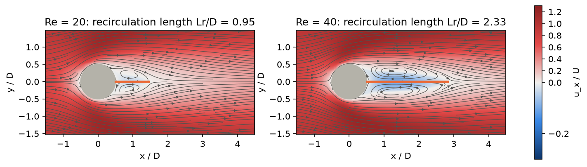
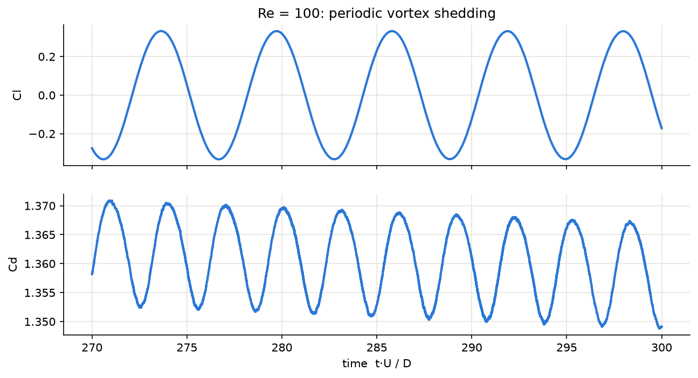
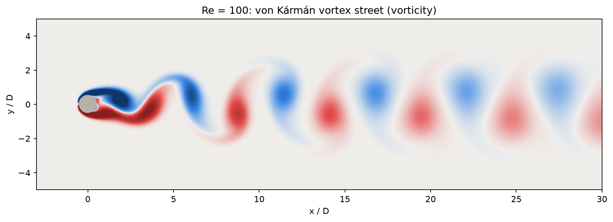

# Solver validation: flow past a circular cylinder

Generated by `validation/cylinder.py`. The DeCFD worker (D2Q9 lattice Boltzmann, BGK,
halfway bounce-back) simulates the textbook benchmark for 2D incompressible solvers and
is compared with published values for an unbounded cylinder.

**Setup.** Domain 50 D × 20 D, cylinder 15 D from the inlet, uniform inlet velocity,
zero-gradient outlet, free-slip side walls (blockage D/H = 5%). The cylinder sits 0.025 D
off the centreline so that the Re = 100 wake starts shedding without an artificial kick.
Each case runs at D = 20 and D = 40 cells in the same physical domain.

**Inlet velocity.** U = 0.1 (Mach 0.17) for Re = 20 and 40; U = 0.05 (Mach 0.087) for
Re = 100. A first attempt at Mach 0.17 put the shedding frequency at 1.14× the channel's
first transverse acoustic mode (c_s / 2H, sound reflects perfectly off free-slip walls):
the lift locked into that resonance and its amplitude grew past 3. At Mach 0.087 the
shedding sits at 0.57× the mode and the street is clean. The same effect exists in real
wind tunnels (acoustic resonance of the test section).

## Results

| Re | Quantity | Reference range | D = 20 | D = 40 | Finest grid vs reference |
|---|---|---|---|---|---|
| 20 | Cd (mean) | 2.00–2.22 | 2.16 | 2.15 | within range |
| 20 | Lr / D | 0.91–0.94 | 0.97 | 0.95 | +1.4% outside |
| 40 | Cd (mean) | 1.48–1.62 | 1.62 | 1.60 | within range |
| 40 | Lr / D | 2.13–2.35 | 2.39 | 2.33 | within range |
| 100 | Strouhal St | 0.160–0.175 | 0.164 | 0.165 | within range |
| 100 | Cd (mean) | 1.33–1.38 | 1.42 | 1.37 | within range |
| 100 | Cl amplitude | 0.25–0.34 | 0.38 | 0.34 | within range |

Reference ranges span the published values below. They are for an unbounded cylinder,
so the 5% blockage of our channel is expected to push Cd and the lift amplitude up.
Doubling the resolution moves every value towards the references.

- Tritton 1959 (experiment): Cd
- Coutanceau & Bouard 1977 (experiment): Lr
- Dennis & Chang 1970; Fornberg 1980 (steady numerical solutions): Cd, Lr
- Braza et al. 1986; Liu, Zheng & Sung 1998; Calhoun 2002; Russell & Wang 2003 (numerical): Re = 100
- Williamson 1996 (experiment, review): St = 0.164 at Re = 100

## Figures

**Steady wakes: streamlines and recirculation length (orange)**

**Lift and drag history at Re = 100**

**Vortex street at Re = 100**

**Vortex street at Re = 100, two shedding periods**

## Run details

| Case | U | τ | Steps | Cd spread | Periods averaged | Saturation |
|---|---|---|---|---|---|---|
| D = 20, Re = 20 | 0.1 | 0.800 | 20000 | 1.9e-04 | – | – |
| D = 20, Re = 40 | 0.1 | 0.650 | 30000 | 1.8e-04 | – | – |
| D = 20, Re = 100 | 0.05 | 0.530 | 120000 | 7.9e-03 | 23 | 1.009 |
| D = 40, Re = 20 | 0.1 | 1.100 | 40000 | 2.3e-04 | – | – |
| D = 40, Re = 40 | 0.1 | 0.800 | 60000 | 1.9e-04 | – | – |
| D = 40, Re = 100 | 0.05 | 0.560 | 240000 | 1.5e-02 | 24 | 1.013 |

Cd spread: max − min of four block averages over the averaging window (steady cases
should be ≈ 0). Saturation: lift amplitude in the first vs second half of the window
(1.000 = fully developed street).
